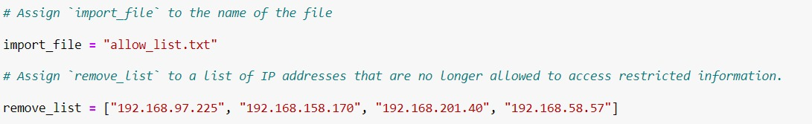
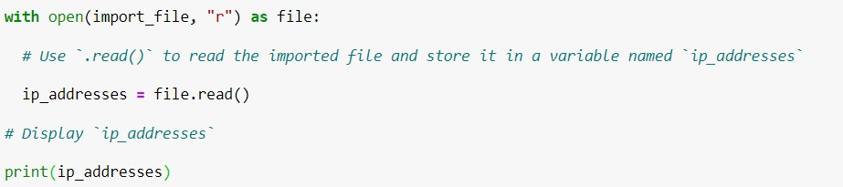
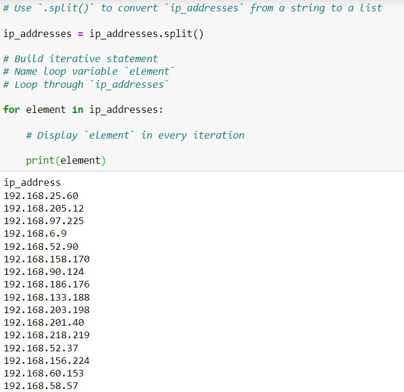
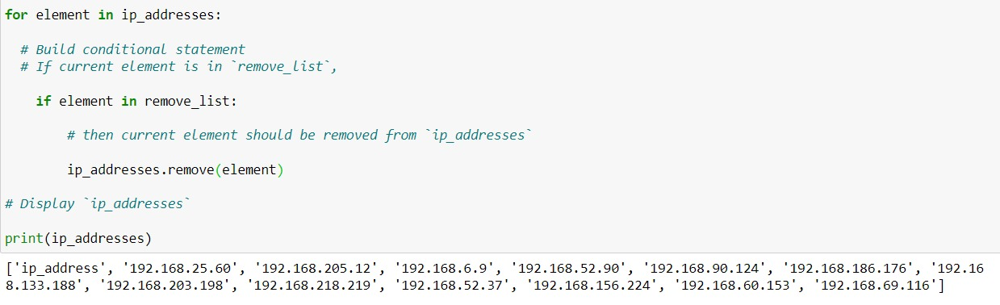

# Botium Toys - Subnetwork IP Access Control

The company's infrastructure handles sensitive business data and customer information, including upcoming product launches and financial records. Access to this subnetwork should be restricted based on employee IP addresses.

## Introduction
Employees who are allowed access should be added to an allow list, while those who should no longer have access (e.g., due to role changes or terminations) should be added to a remove list.

As part of the ongoing security audit for Botium Toys, we will identify any IP addresses on the allow list that also appear on the remove list. If an IP address is found on both lists, it will be removed from the allow list to prevent unauthorized access to the restricted subnetwork. We will use Python to develop a solution that automates this process and ensures that the allow list is continuously cleaned up.

## Step 1 - Import the Allow List File

We start by importing the file that contains the list of allowed IP addresses. The IP addresses that are to be removed are stored in a separate list variable.

---

## Step 2 - Opening the File Using the `with` Statement

We use the `with` statement to open the file because it automatically handles closing the file once the work is done, which helps prevent errors.

**Note:** Since we are just parsing the file and storing its contents into a string format, we do not need write (`w`) or append access. The file is opened in read-only mode (`r`) to ensure that it cannot be altered at this stage.

---

## Step 3 - Converting the String into a List

The `split()` method in Python helps generate a list from a string, breaking it into individual elements based on a separator. By default, it uses whitespace, but other separators can be specified.

---

## Step 4 - Compare with the Remove List

Each element of the allowed list is compared to the remove list. If a match is found, it is removed from the allowed list immediately, ensuring the list is up to date.

---

## Step 5 - Updating `allowed_list.txt`

The `join()` method does the opposite of `split()` by concatenating list elements into a string. We specify a space `" "` as our separator. Finally, the updated string is used to overwrite the original contents of the file, for which the file is opened in write mode (`w`).

