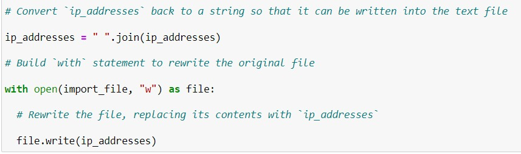

The company's infrastructure handles sensitive business data and customer information, including upcoming product launches and financial records
Access to this subnetwork should be restricted based on employee IP addresses.

## How to go about doing this?  
Employees who are allowed access should be added to an allow list, while those who should no longer have access (e.g., due to role changes or terminations) should be added to a remove list.

As part of the ongoing security audit for Botium Toys, we will identify any IP addresses on the allow list that also appear on the remove list. If an IP address is found on both lists, 
it will be removed from the allow list to prevent unauthorized access to the restricted subnetwork. We will use Python to develop a solution that automates this process and ensures that the allow list is continuously cleaned up. 

## Step 1 - we import the file that has the list of allowed IP Addresses. Also, the IP Addresses that are to be removed are stored in a list variable

## Step 2 - Opening the file using 'with' statement -  
Firstly, 'with' statement is chosen for its benefit of automatically closing the file itself once the work is done, this takes off the task from the programmer's hands
Note - As you can see, since we are just parsing the file and storing its contents into a string format - we DONT need to open it with 'w' (write) or 'append' access. To ensure that it cannot be
altered at this stage, the file is carefully opened with the read mode only 'r'.

## Step 3 - Converting the string into a list for working over it -  
split() method in Python helps to generate a list of items from a string, and the string is broken into individual elements based on a seperator. By default it is set as a whitespace, but we may choose to 
add some other seperator of choice by passing it as an argument in the function call.

## Step 4 - 
Now, each element of the allowed list will be compared to the removed list provided, and if a match is found, then it is removed from the allowed list there and then. This way, the allowed IP
Addresses get updated.

## Step 5 - Updating allowed_list.txt
.join() method does the opposite of what .split() does, it is now used to concatenate the list elements into a string. Here, we have specified " " as our seperator.
Finally, the updated string is made to overwrite the original contents of the file. For this, we have purposely opened the file in write mode 'w'

